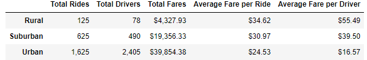
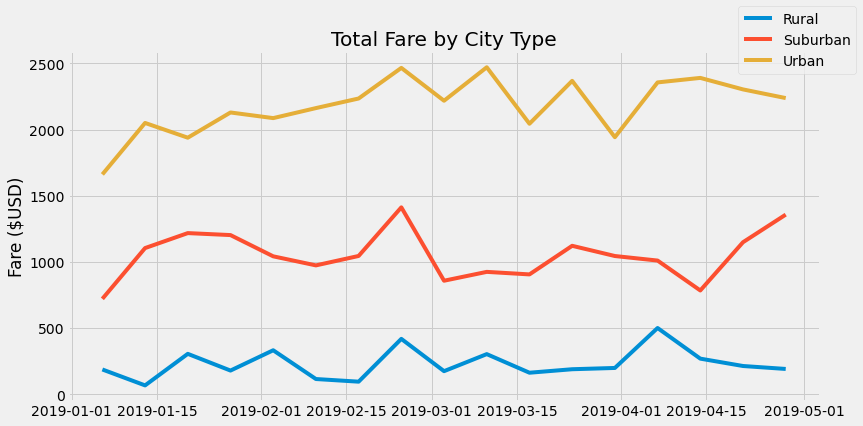

# PyBer_Analysis
## Overview
The purpose of this analysis is to measure ride-sharing statistics through serveral diffrent metrics. The ride-sharing data is split up based on rural, urban, or suburban city types. Data on the amount of rides, total drivers, total fares, average fare per ride, and average fare per driver are recorded in a data frame grouped by the previously mentioned city-type categories.
## Results
Through the creation of the data frame in "dataframe.png", we gained several insights on the distinctions between city-types in their ride-sharing metrics. If a rural area is more sparsely populated than a suburban area, and a suburban area more sparsely populated than an urban area. The less population dense a city is, the total rides, drivers, and fare go down, while the average fare per driver and average fare per ride go up.

The line graph created by the script shows total fare over time for each city type with a bin size of 1 week. It tells us that urban ride sharing consistently yields the highest total fares, with suburban consistently being the second, and rural being in last. Also, warmer months could possibly favor suburban cities as far as higher total fares go.

## Summary
From the analysis, there seems to be a shortage of drivers in rural areas and an overabundance of drivers in urban areas. "dataframe.png" shows that there were less rides in urban areas than there were drivers. There were also many less drivers than rides in rural areas. I would recommend a shift in personell from urban to rural areas based on this.
